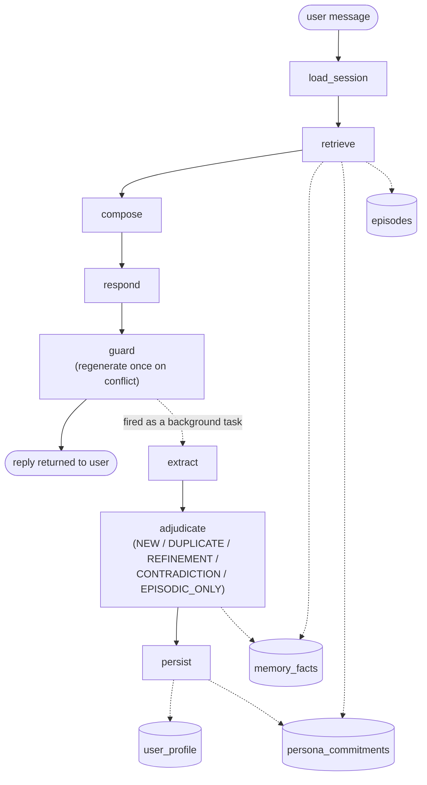

# oncemore

A memory and personality-consistency core for an AI companion, built on
LangGraph, Postgres/pgvector, Redis, and OpenAI Structured Outputs.

The problem this solves: a chat model with a system prompt forgets
everything between sessions, and if you just shove a growing transcript
back in as context it eventually contradicts itself ("didn't you say you
broke up with your ex three weeks ago?"). This project is a memory layer
that sits in front of a chat model and gives it:

- **Long-term recall** of facts the user has shared, retrieved by relevance
  and recency rather than replayed as raw transcript.
- **Contradiction handling** — when a new statement conflicts with
  something already stored, the old belief is explicitly superseded, not
  silently duplicated or overwritten with no trace.
- **A consistent character** that doesn't contradict its own past claims
  about itself, and doesn't flatten into a generic assistant under
  pressure (jailbreak attempts, "just give me a bulleted list" requests,
  "are you an AI" questions).

## How it works

Each turn moves through two stages:

1. **Reply.** Fetch relevant memories, build a prompt, generate a reply,
   then check that reply against the companion's own past claims and
   regenerate it once if it contradicts itself or breaks character. This
   part runs synchronously so the user gets an answer right away.
2. **Memory update.** Pull candidate facts out of the turn and decide, for
   each one, whether it's new, a duplicate, a refinement, or a
   contradiction of something already stored — then save the result. This
   part runs in the background after the reply is sent, so it never adds
   to reply latency.

Nothing is ever deleted: a contradicted fact is marked superseded rather
than overwritten, so the system's history of what it believed and when
stays queryable.

A separate, fully synchronous version of the pipeline also exists for the
scripted tests and the eval harness, so they can check the database
immediately instead of waiting on a background task.



Solid arrows are the synchronous per-turn path; dashed arrows are the
background write path and reads/writes against Postgres.

## Tech stack

| Concern | Choice |
|---|---|
| Orchestration | LangGraph (`StateGraph`) |
| Chat + structured extraction | OpenAI, via LangChain's `ChatOpenAI` with Structured Outputs (strict JSON schema, not "JSON mode") |
| Embeddings | OpenAI `text-embedding-3-small` |
| System of record | PostgreSQL + `pgvector` + `pg_trgm` |
| Cache / checkpoint store | Redis |
| DB driver | `psycopg3` (async), hand-written SQL — no ORM |
| Config | `pydantic-settings`, `.env` |
| Logging | `structlog` |
| Dependency/env management | `uv` |

## Why two datastores

Postgres is the only system of record (facts, profile, commitments,
episodes, the turn log). Redis holds only the LangGraph thread checkpoint,
the embedding cache, and a short-lived per-session memory-block cache. The
invariant that must never be violated: **if Redis is empty, the system is
slower and more expensive, never wrong.** Nothing written to
`storage/cache.py` is allowed to become a source of truth.

## Two shapes of semantic memory

This split is the core design idea:

- **`user_profile`** (`storage/profile.py`) — ~15 predictable attributes
  (relationship status, employer, location, ...). A contradiction here is a
  cheap field overwrite plus an audit row in `user_profile_history`. No
  embedding, no LLM call.
- **`memory_facts`** (`storage/facts.py`) — a bi-temporal ledger for
  everything unpredictable. Every write pays for an embedding, a neighbour
  search, and an adjudicator call that decides whether the new fact is
  genuinely new, a duplicate, a refinement of an existing fact, a direct
  contradiction (which supersedes the old one), or too ephemeral to keep in
  the ledger at all.

`memory_facts` is bi-temporal: `valid_from`/`valid_to` track when something
was true in the world, `created_at`/`expired_at` track when the system
believed it. A contradiction closes the old row's `valid_to`, sets
`status = 'superseded'`, and points `superseded_by` at the new row — both
rows stay queryable via `facts.history_for_slot`.

There's a third and fourth memory shape too: `episodes` (relational moments
worth remembering as an experience, plus pinned "voice anchor" examples
used as few-shot prompts to keep the character's tone from flattening), and
`persona_commitments` (what the companion has said about *itself*, so it
doesn't contradict its own claims 60 turns later — the one memory type not
covered by LangMem's user/episodic/procedural taxonomy).

## Directory structure

```
oncemore/
├── cli.py                    Interactive REPL — the primary way to talk to the companion locally
├── config.py                 All tunables (models, retrieval weights, thresholds), via pydantic-settings
├── schemas.py                Pydantic contracts for every LLM boundary (extraction, adjudication, guard) and every stored row
├── llm.py                    The only place that calls OpenAI: Structured Outputs wrapper + prompt assembly (build_prompt)
├── logs.py                   structlog configuration; import get_logger everywhere instead of stdlib logging
├── prompt_optimizer.py       Optimizes the "adaptive" prompt zone from real conversation history, gated behind the eval suite
├── docker-compose.yml        Postgres (pgvector) + Redis, for local dev
├── pyproject.toml            Dependencies, dependency groups (dev / eval), ruff + pytest config
│
├── persona/
│   ├── canon.py               Frozen persona canon for "Mira" — name, backstory, traits, opinions (hand-written, never auto-edited)
│   ├── esha.py                A second frozen persona canon, "Esha", same shape as canon.py
│   └── registry.py            Maps a persona_id string to its canon module
│
├── graph/
│   ├── state.py                The ConversationState shape threaded through the graph
│   ├── build.py                Wires the nodes into full/fast compiled StateGraphs; run_turn / run_turn_fast / run_write_path
│   └── nodes/
│       ├── load_session.py       Reattaches to (or starts) the Postgres session/turn log for this thread
│       ├── retrieve.py           Hybrid search across facts/commitments/episodes, MMR dedupe, token-budget truncation
│       ├── compose.py            Assembles the system prompt via llm.build_prompt
│       ├── respond.py            Generates the candidate reply
│       ├── guard.py              Checks the drafted reply for self-contradiction or persona breakdown; regenerates once if flagged
│       ├── extract.py            Pulls candidate facts / profile updates / persona commitments out of the turn
│       ├── adjudicate.py         Decides NEW / DUPLICATE / REFINEMENT / CONTRADICTION / EPISODIC_ONLY for each candidate fact
│       ├── persist.py            Applies the cheap-path writes: profile field overwrites and persona commitments
│       └── transcript.py         Shared helper to render the message window into one system+user prompt
│
├── prompts/
│   ├── extraction.py           System prompt for extract.py
│   ├── adjudication.py         System prompt for adjudicate.py
│   └── guard.py                System prompt for guard.py
│
├── storage/
│   ├── pg.py                   Async psycopg3 connection pool + schema bootstrap
│   ├── cache.py                Redis: embedding cache, memory-block cache, session scratch — never authoritative
│   ├── embeddings.py            OpenAI embeddings, cached through Redis
│   ├── facts.py                 The bi-temporal fact ledger: hybrid search (RRF), decay-based reranking, supersession
│   ├── profile.py                The cheap predictable-attribute overwrite path + audit history
│   ├── commitments.py            Persona self-memory: what the companion has claimed about itself
│   ├── episodes.py               Relational moments + pinned voice-anchor few-shot examples, capped at 20
│   ├── messages.py               The durable turn log (provenance for every memory write, plus per-message feedback)
│   ├── prompt_versions.py        The "adaptive" procedural-memory zone: optimizer candidates and the promoted version
│   └── eval_runs.py              Writes eval harness results to eval_runs / eval_results
│
├── eval/
│   ├── scenario.py              YAML scenario format (turns, planted facts, retrieval probes, contradictions) + loader
│   ├── metrics.py                Deterministic scoring: extraction precision/recall, retrieval recall@k / MRR, supersession accuracy
│   └── scenarios/
│       ├── breakup_relationship.yaml   Plant → probe → contradict → probe, on a RELATIONSHIP fact
│       └── job_change.yaml             Same shape, on a PLAN fact (a move that falls through)
│
├── db/
│   └── schema.sql               Full DDL for every table, idempotent (safe to re-run)
│
└── scripts/
    ├── init_db.py                Applies db/schema.sql
    ├── smoke_test.py              Proves the storage layer: a fact survives a process restart, a contradiction supersedes it
    ├── seed_persona.py            Seeds the hand-written voice-anchor episodes for a persona
    ├── test_persona.py            ~10-turn manual sanity check that the persona reads as a specific character
    ├── test_graph.py              Scripted conversation through the real graph: plant a fact, revisit it, contradict it, assert supersession
    ├── test_long_conversation.py  Same idea at 55-turn scale, with topic-pressure probes spread throughout
    ├── optimize_prompt.py         Generates an adaptive-prompt candidate from real history, prompts before promoting
    └── run_eval.py                Runs every eval/scenarios/*.yaml scenario through the real graph and prints a results table
```

## Running it locally

```bash
cd oncemore

docker compose up -d                        # Postgres (pgvector) on 5432, Redis 8 on 6379
cp .env.example .env                        # then set OPENAI_API_KEY

uv sync                                     # creates .venv, resolves from pyproject.toml
uv run python scripts/init_db.py            # applies db/schema.sql — idempotent, safe to rerun

uv run python scripts/smoke_test.py         # verifies the storage layer against live Postgres/Redis
uv run companion                            # interactive chat loop (registered console script)
```

`uv run companion` is the primary way to try it out — it defaults to a demo
user/thread, so memory persists across runs without any extra setup: run
it, say something, exit, run it again, and it remembers (including which
persona you picked the first time).

### Other entry points

```bash
uv run python scripts/seed_persona.py           # seed voice-anchor episodes before your first real conversation
uv run python scripts/test_graph.py             # scripted plant/contradict/verify check through the real graph
uv run python scripts/test_long_conversation.py # the same check at 55-turn scale
uv run python scripts/optimize_prompt.py <user_id>  # generate + review an adaptive-prompt candidate

uv sync --group eval                            # pulls in pyyaml/tabulate/openevals for the eval harness
uv run python scripts/run_eval.py               # runs the scenario-based eval suite, prints a results table
```

`uv run ruff check .` lints the project. `pytest` is configured in
`pyproject.toml` but there's no `tests/` directory yet — the scripts above
(all of which hit live Postgres/Redis and the real OpenAI API) are the
executable verification for now.

## Notable design decisions

- **No ORM.** `psycopg3` with hand-written SQL, because the ledger's value
  is in specific, tuned queries (an RRF-fusion hybrid search, bi-temporal
  supersession updates) that are meant to stay visible and debuggable.
- **Structured Outputs, not JSON mode**, for every LLM call that needs a
  typed result — this guarantees schema conformance rather than just valid
  JSON. Because strict mode strips JSON Schema validation keywords
  (`minimum`, `maximum`, `pattern`, ...), numeric ranges are documented in
  each field's description and clamped in Python after parsing instead.
- **Fixed prompt ordering for cache reuse.** `llm.build_prompt` assembles
  the system prompt in one fixed order (persona → voice anchors → profile →
  cache boundary → commitments → memories) so the prefix above the boundary
  stays byte-identical across turns and qualifies for OpenAI's prompt
  caching discount.
- **Decay is a ranking signal, never a deletion.** A fact's retrieval
  strength fades on a per-type half-life (mood fades in days, identity
  effectively never does), so a bad mood stops dominating retrieval by the
  following week without the memory being erased. The one place that
  actually deletes is a hard cap of 20 relational episodes, to stop
  low-value memories from swamping retrieval.
- **A synchronous and a fast path through the graph.** `build_graph` runs
  extract → adjudicate → persist inline, so a scripted test can assert on
  the resulting DB state immediately. `build_fast_graph` stops as soon as
  the reply is ready and lets the caller (`cli.py`) run the write path as a
  background task, so an interactive session isn't blocked on 3-4 extra LLM
  calls after every reply.

## Known limitations

- **Contradictions don't cascade.** If a relationship-status contradiction
  supersedes the "user is dating X" fact, other facts that implicitly
  depended on it (a planned trip together, a plan for X to meet the user's
  family) stay active untouched — the adjudicator only reasons about one
  new candidate against its own direct neighbours, not the wider graph of
  facts about the same entity.
- **The adjudicator is one LLM call per candidate fact.** Fine at
  conversational turn rates; would need batching for bulk backfill or
  replay tooling.
- **`extraction_aggressiveness` is a config knob with no consumer yet** —
  intended for a precision/recall sweep once more eval scenarios exist.
- **`hot_path_importance_threshold` and `is_explicit_remember_request` are
  unused.** The intent (write a high-importance or explicitly-requested
  fact synchronously, before the reply is sent, instead of in the
  background) was never wired into `graph/build.py` — every write today
  goes through the same background task regardless of importance.
- **The eval harness (`eval/`) is store-level only.** It checks extraction,
  retrieval, and supersession deterministically against real database
  state, with no LLM judge involved. A response-quality tier (rubric-based
  judging of full replies, hand-labelled against the judge) is a natural
  next addition but isn't built.
- **Model name strings in `config.py` are placeholders** and should be
  re-verified against the live model list before a real deployment.
